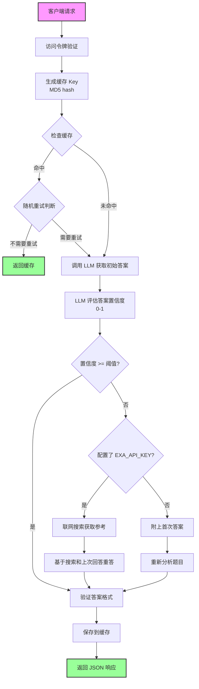

# LLM 智能答题服务

基于大语言模型（LLM）的智能答题服务，支持单选、多选、判断、填空等多种题型。提供 HTTP API 接口、本地缓存功能、置信度评估和智能联网搜索增强。


## 核心特性

### 智能答题系统
- **多题型支持**：单选题、多选题、判断题、填空题
- **置信度评估**：自动评估答案可信度，低置信度自动触发增强策略
- **双模式增强**：
  - 配置 `EXA_API_KEY` 时：联网搜索获取参考信息
  - 未配置时：附上首次答案重新分析
- **答案验证**：自动验证答案格式，失败自动重试（最多 3 次）

### 性能优化
- **智能缓存**：SQLite 数据库缓存答案，避免重复调用 API
- **随机重试**：缓存命中时按概率随机重试，防止错误答案永久缓存
- **异步架构**：基于 FastAPI 和 AsyncOpenAI，支持高并发请求
- **数据库优化**：WAL 模式 + 64MB 缓存 + NORMAL 同步模式

### 安全与控制
- **访问控制**：支持通过 `ACCESS_TOKEN` 进行接口访问鉴权
- **灵活配置**：支持自定义模型、API 地址、置信度阈值等
- **跨平台支持**：自动处理 UTF-8 编码，兼容 Windows/Linux/macOS

## 环境要求

- Python 3.7+
- OpenAI API 密钥（或兼容的 API 服务）
- （可选）Exa AI API 密钥（用于联网搜索增强）

## 快速开始

### 1. 安装依赖

```bash
pip install openai fastapi uvicorn aiosqlite python-dotenv aiohttp
```

### 2. 配置环境变量

复制 `.env.example` 为 `.env`：

```bash
cp .env.example .env
```

编辑 `.env` 文件：

```env
# ========== 必填配置 ==========
# OpenAI API 密钥
OPENAI_API_KEY=your_api_key_here

# ========== 可选配置 ==========
# 模型名称（默认：gpt-3.5-turbo）
OPENAI_MODEL=gpt-3.5-turbo

# API 基础 URL（用于自定义 API 端点）
OPENAI_BASE_URL=https://api.openai.com/v1

# 服务监听端口（默认：5000）
LISTEN_PORT=5000

# 访问令牌（用于接口鉴权）
ACCESS_TOKEN=your_secret_token_here

# ========== 智能增强配置 ==========
# 置信度阈值（默认：0.7，范围 0-1）
# 低于此阈值会触发增强策略（联网搜索或重新分析）
CONFIDENCE_THRESHOLD=0.7

# Exa AI API 密钥（用于联网搜索）
# 未配置时将使用"重新分析"模式替代联网搜索
EXA_API_KEY=your_exa_api_key_here

# ========== 缓存策略配置 ==========
# 缓存随机重试概率（默认：0.1，即 10% 概率重试）
# 防止错误答案被永久缓存
CACHE_RETRY_PROBABILITY=0.1
```

### 3. 启动服务

```bash
# 标准启动
python llm_answerer.py

# 禁用缓存（所有请求直接调用 LLM）
python llm_answerer.py --skip-cache
```

启动后会显示服务配置信息和 AnswererWrapper 集成代码。

## 工作流程

### 完整请求流程

### 置信度增强机制

当 LLM 对答案的置信度低于阈值时，系统会自动启用增强策略：

#### 模式 1：联网搜索模式（推荐）

**条件**：配置了 `EXA_API_KEY`

**流程**：
1. 使用 Exa AI 搜索相关信息（默认获取 3 条结果）
2. 提取搜索结果的文本内容
3. 将搜索内容作为上下文重新提问 LLM
4. 返回基于搜索增强的答案

**优势**：
- 获取最新、准确的外部信息
- 适用于需要时效性或专业知识的题目
- 大幅提升答案准确率

#### 模式 2：重新分析模式（备选）

**条件**：未配置 `EXA_API_KEY`

**流程**：
1. 构建包含首次答案和置信度的提示词
2. 告知 LLM 首次答案置信度较低
3. 要求 LLM 重新仔细分析题目
4. 返回重新分析后的答案

**优势**：
- 无需额外 API 密钥
- 零成本增强（仅增加一次 LLM 调用）
- 适用于 LLM 已有知识但首次分析不够仔细的情况

## API 接口文档

### 1. 健康检查

```http
GET /
```

**响应：**
```
服务已启动
```

### 2. 答题接口

**端点：** `/search`
**方法：** `GET` 或 `POST`

#### 请求参数

| 参数 | 类型 | 必填 | 说明 |
|------|------|------|------|
| `title` | string | 是 | 题目内容 |
| `options` | string | 否 | 选项内容（选择题必填），格式：`A.选项1\nB.选项2\nC.选项3` |
| `type` | string | 否 | 题型：`single`（单选）、`multiple`（多选）、`judgement`（判断）、`completion`（填空） |
| `skip_cache` | boolean | 否 | 是否跳过缓存，默认 `false` |
| `token` | string | 否 | 访问令牌（如已配置 `ACCESS_TOKEN`） |

#### 请求示例

**GET 请求：**
```bash
curl "http://localhost:5000/search?title=Python是一种什么类型的语言？&options=A.编译型\nB.解释型\nC.汇编型\nD.机器语言&type=single"
```

**POST 请求（推荐）：**
```bash
curl -X POST http://localhost:5000/search \
  -H "Content-Type: application/json" \
  -d '{
    "title": "Python是一种什么类型的语言？",
    "options": "A.编译型\nB.解释型\nC.汇编型\nD.机器语言",
    "type": "single"
  }'
```

**带访问令牌：**
```bash
curl -X POST http://localhost:5000/search \
  -H "Content-Type: application/json" \
  -H "X-Access-Token: your_secret_token_here" \
  -d '{
    "title": "量子计算机使用量子位进行计算。",
    "type": "judgement"
  }'
```

#### 响应格式

**成功响应：**
```json
{
  "code": 1,
  "question": "Python是一种什么类型的语言？",
  "answer": "B"
}
```

**失败响应：**
```json
{
  "code": 0,
  "msg": "错误信息"
}
```

#### 答案格式规范

| 题型 | 格式 | 示例 |
|------|------|------|
| 单选题（`single`） | 单个字母 A-Z | `B` |
| 多选题（`multiple`） | 多个字母用 `#` 分隔 | `A#C#D` |
| 判断题（`judgement`） | 中文"正确"或"错误" | `正确` |
| 填空题（`completion`） | 文本内容，多空用 `#` 分隔 | `答案1#答案2` |

### 3. 访问鉴权

如果配置了 `ACCESS_TOKEN`，需要提供访问令牌，支持三种方式：

**方式 1：请求头（推荐）**
```bash
-H "X-Access-Token: your_secret_token_here"
```

**方式 2：查询参数**
```bash
?token=your_secret_token_here
```

**方式 3：POST Body**
```json
{
  "title": "题目",
  "token": "your_secret_token_here"
}
```

## 集成到 AnswererWrapper

服务启动后会自动输出 AnswererWrapper（浏览器答题脚本框架）配置，直接复制使用即可。

**配置示例：**
```json
[
  {
    "name": "LLM智能答题",
    "url": "http://localhost:5000/search",
    "method": "post",
    "contentType": "json",
    "type": "GM_xmlhttpRequest",
    "headers": {
      "Content-Type": "application/json",
      "X-Access-Token": "your_secret_token_here"
    },
    "data": {
      "title": "${title}",
      "options": "${options}",
      "type": "${type}"
    },
    "handler": "return (res) => res.code === 1 ? [undefined, res.answer] : [res.msg, undefined]"
  }
]
```

## 技术架构

### 核心组件

**1. LLMAnswerer 类（`llm_answerer.py`）**
- 主业务逻辑：管理 LLM 交互和答案缓存
- 数据库连接管理：初始化、查询、写入
- 关键方法：
  - `answer_question()`: 答题主入口
  - `_get_cached_answer()`: 缓存读取
  - `_save_to_cache()`: 缓存写入

**2. 置信度评估模块（`confidence.py`）**
- 智能答题协调：LLM 调用 + 置信度评估 + 增强策略
- 关键函数：
  - `answer_with_confidence()`: 主流程控制
  - `_call_llm_with_validation()`: 带验证的 LLM 调用（自动重试）
  - `validate_answer()`: 答案格式验证

**3. 搜索服务（`search.py`）**
- Exa AI 搜索 API 异步封装
- 关键方法：
  - `search()`: 执行搜索请求
  - `extract_context()`: 提取搜索结果文本
  - `search_and_extract()`: 一站式搜索并提取

**4. FastAPI 应用（`llm_answerer.py`）**
- RESTful API 端点：`/` 健康检查、`/search` 答题
- 生命周期管理：`lifespan()` 管理数据库连接
- 灵活参数传递：支持 GET/POST、多种鉴权方式

**5. 数据库层（`llm_answerer.py`）**
- 异步 SQLite：使用 aiosqlite
- 性能优化：WAL 模式 + 64MB 缓存 + NORMAL 同步
- 表结构：`answer_cache` 表，MD5 hash 索引

### 技术栈

- **Web 框架**：FastAPI（异步高性能）
- **LLM 客户端**：AsyncOpenAI（异步 OpenAI SDK）
- **搜索服务**：Exa AI（智能搜索 API）
- **数据库**：aiosqlite（异步 SQLite）
- **配置管理**：python-dotenv
- **HTTP 客户端**：aiohttp

### 数据库结构

**表名：** `answer_cache`

| 字段 | 类型 | 说明 |
|------|------|------|
| `id` | INTEGER | 自增主键 |
| `question_hash` | TEXT | 题目 MD5 哈希值（唯一索引） |
| `title` | TEXT | 题目内容 |
| `options` | TEXT | 选项内容 |
| `question_type` | TEXT | 题型 |
| `answer` | TEXT | 答案 |
| `created_at` | TIMESTAMP | 创建时间 |

**缓存键生成规则：**
```python
cache_key = hashlib.md5(f"{title}{options}".encode()).hexdigest()
```

## 配置说明

### 置信度阈值调优

`CONFIDENCE_THRESHOLD` 控制何时触发增强策略，取值范围 0-1：

| 阈值 | 触发频率 | 适用场景 |
|------|----------|----------|
| 0.9 | 极低 | 仅在 LLM 几乎不确定时增强，追求成本最优 |
| 0.7（默认） | 适中 | 平衡准确率和成本 |
| 0.5 | 较高 | 对答案质量要求高，容忍更多 API 调用 |

**建议：**
- 成本敏感：0.8 - 0.9
- 准确率优先：0.5 - 0.7
- 平衡方案：0.7（默认值）

### 缓存重试概率

`CACHE_RETRY_PROBABILITY` 防止错误答案永久缓存：

| 概率 | 说明 |
|------|------|
| 0.1（默认） | 每 10 次缓存命中有 1 次重新查询 |
| 0.0 | 完全信任缓存（不推荐） |
| 0.5 | 激进重试，50% 概率重查 |

**推荐：** 保持默认 0.1，在缓存命中率和答案更新之间取得平衡。

## 常见问题

### Q1: 如何降低 API 调用成本？

**建议：**
1. 启用缓存（默认开启）
2. 使用 `gpt-3.5-turbo` 模型
3. 适当调高 `CONFIDENCE_THRESHOLD`（如 0.8）
4. 不配置 `EXA_API_KEY`，使用"重新分析"模式

### Q2: 答案准确率不高怎么办？

**建议：**
1. 配置 `EXA_API_KEY` 启用联网搜索
2. 降低 `CONFIDENCE_THRESHOLD`（如 0.5-0.6）
3. 升级模型到 `gpt-4-turbo` 或 `gpt-4`
4. 增大 `CACHE_RETRY_PROBABILITY`（如 0.2）

### Q3: 联网搜索失败怎么办？

**自动降级：** 搜索失败会自动返回原始答案，不影响服务可用性。

**排查步骤：**
1. 检查 `EXA_API_KEY` 是否正确
2. 检查网络连接是否正常
3. 查看控制台日志中的错误信息

### Q4: 如何跳过缓存测试新模型？

**方法 1：** 全局跳过缓存
```bash
python llm_answerer.py --skip-cache
```

**方法 2：** 单次请求跳过缓存
```bash
curl -X POST http://localhost:5000/search \
  -H "Content-Type: application/json" \
  -d '{"title": "题目", "skip_cache": true}'
```

### Q5: 答案格式验证失败怎么办？

**自动处理：** 系统会自动重试 3 次，大多数情况下可自动修复。

**如仍失败：**
1. 检查题目和选项格式是否正确
2. 尝试更换模型
3. 检查 `type` 参数是否与题目类型匹配

### Q6: Windows 中文乱码怎么办？

**自动处理：** 服务启动时会自动配置 UTF-8 编码。

**手动设置：**
```bash
# 设置环境变量
set PYTHONIOENCODING=utf-8

# 切换代码页
chcp 65001

# 启动服务
python llm_answerer.py
```

## 开发与测试

### 测试置信度模块

```bash
python confidence.py
```

运行后会执行内置测试用例，展示完整的置信度评估流程。

### 测试搜索服务

```bash
python search.py
```

测试 Exa AI 搜索功能是否正常工作。

### 手动测试 API

```bash
# 测试单选题
curl -X POST http://localhost:5000/search \
  -H "Content-Type: application/json" \
  -d '{
    "title": "Python中，哪个函数用于获取列表的长度？",
    "options": "A.size()\nB.length()\nC.len()\nD.count()",
    "type": "single"
  }'

# 测试判断题
curl -X POST http://localhost:5000/search \
  -H "Content-Type: application/json" \
  -d '{
    "title": "量子计算机使用量子位进行计算。",
    "type": "judgement"
  }'

# 测试多选题
curl -X POST http://localhost:5000/search \
  -H "Content-Type: application/json" \
  -d '{
    "title": "以下哪些是编程语言？",
    "options": "A.Python\nB.HTML\nC.Java\nD.CSS",
    "type": "multiple"
  }'
```

## 项目文件结构

```
question-libraries/
├── llm_answerer.py          # 主程序：FastAPI 服务 + LLMAnswerer 类
├── confidence.py            # 置信度评估模块
├── search.py                # Exa AI 搜索服务封装
├── .env.example             # 环境变量配置模板
├── .env                     # 环境变量配置（需自行创建）
├── answer_cache.db          # SQLite 数据库（自动创建）
├── README.md                # 项目文档（本文件）
├── CLAUDE.md                # Claude Code 开发指南
└── requirements.txt         # 依赖列表（可选）
```

## 性能指标

**典型响应时间（含缓存）：**
- 缓存命中：< 50ms
- 首次查询（无增强）：1-3 秒
- 联网搜索增强：5-10 秒
- 重新分析增强：2-4 秒

**并发能力：**
- 基于 FastAPI 异步架构，支持数百并发请求
- 数据库使用 WAL 模式，支持并发读写

**成本估算（gpt-3.5-turbo）：**
- 无增强：约 $0.001 - $0.002 / 次
- 重新分析增强：约 $0.002 - $0.003 / 次
- 联网搜索增强：约 $0.003 - $0.005 / 次 + Exa AI 费用

## 注意事项

1. **API 密钥安全**
   - 不要将 `.env` 文件提交到版本控制系统
   - 生产环境建议使用环境变量而非 `.env` 文件

2. **数据库备份**
   - 定期备份 `answer_cache.db`
   - 数据库文件损坏可重新生成，但会丢失缓存

3. **搜索服务依赖**
   - Exa AI 可能有 API 速率限制
   - 建议监控搜索失败率，必要时调高 `CONFIDENCE_THRESHOLD`

4. **模型兼容性**
   - 支持所有 OpenAI 兼容 API
   - 其他模型可能需要调整提示词

5. **网络要求**
   - 需要访问 OpenAI API（或自定义端点）
   - 使用联网搜索时需要访问 Exa AI

## 更新日志

### v0.3 - 置信度增强系统
- 新增置信度评估机制
- 新增联网搜索模式（Exa AI）
- 新增重新分析模式（无需额外 API）
- 新增答案格式自动验证和重试
- 优化提示词构建逻辑

### v0.2 - 基础版本
- 支持四种题型答题
- SQLite 缓存系统
- 访问令牌鉴权
- AnswererWrapper 集成

## 许可证

本项目仅供学习和研究使用。

## 技术支持

遇到问题请提供以下信息：
1. 完整的错误日志
2. `.env` 配置（隐藏敏感信息）
3. 请求示例和响应
4. Python 版本和依赖版本

---

**提示：** 首次使用建议先用默认配置测试，确认基础功能正常后再调整参数优化。
